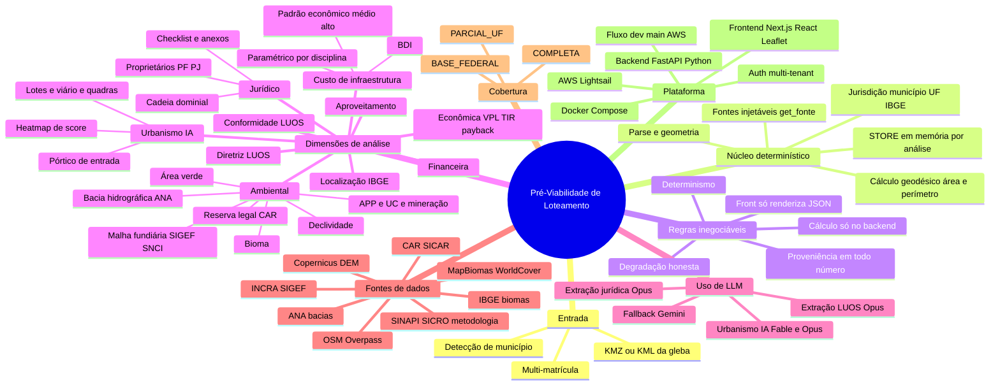

# Mapa Mental — Pré-Viabilidade de Loteamento

> Diagrama Mermaid (`mindmap`). Renderiza no GitHub, no VS Code (extensão Mermaid), no Obsidian,
> ou cole em **https://mermaid.live**. Para abrir no navegador com 2 cliques, use
> `docs/mapa-mental.html` (mesmo conteúdo, renderizado).

