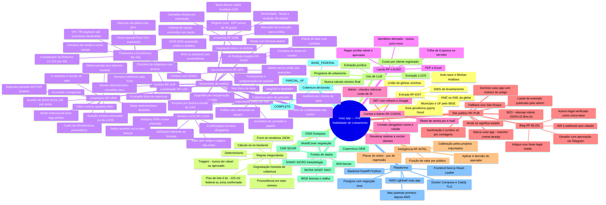

# Mapa Mental — voaz.app

> Diagrama Mermaid (`mindmap`). Renderiza direto no GitHub, no VS Code (extensão Mermaid),
> no Obsidian, ou cole em **https://mermaid.live**. Para abrir no navegador com 2 cliques,
> use `docs/mapa-mental.html` (mesmo conteúdo, renderizado).
>
> Os rótulos `RF-*` são os IDs do `docs/requisitos.md`; o detalhamento de cada ramo está
> no `docs/requisitos-detalhados.md`. **Manutenção: fase nova = atualizar os três no mesmo
> commit da fase.** Atualizado em 30/07/2026.

```mermaid
mindmap
  root((voaz.app — Pré-Viabilidade de Loteamento))
    Entrada RF-ENT
      KMZ ou KML da gleba
      União de glebas vizinhas
      Município e UF pelo IBGE
      Área geodésica pyproj Geod
      Auto-save e Minhas Análises
      DWG de levantamento
    Regras inegociáveis
      Cálculo só no backend
      Front só renderiza JSON
      Proveniência em todo número
      Determinismo
      Degradação honesta de cobertura
      Piso de lote é lei - 125 m2 federal ou zona confirmada
      Triagem - nunca diz viável ou aprovado
    Dimensões de análise
      Ambiental RF-AMB
        Camadas oficiais por interseção
        Vegetação dura x a verificar
        Declividade - faixas e vedação 30 urbana
        Regime rural - APP acima de 45 graus
        Bacia bioma malha fundiária CAR
        Marcador de execução para a trilha
        Vistoria de campo reconcilia com laudo
      Aproveitamento RF-APR
        Gleba menos união das restrições
        Teto físico de lotes
        Cenário com diretriz
      Urbanismo RF-URB
        IA propõe o programa
        Motor determinístico desenha
        Viário conexo quadras lotes
        Verde institucional lazer lago pórtico
        5 variantes e função de valor
        Segunda passada MOTOR-SOBRA
        Gleba estreita sem labirinto rotulada
        Quadro de áreas fecha 100 por cento
        Doação mínima informada ou da LUOS
        Custo de infraestrutura paramétrico
      Importação DWG RF-IMP
        dwg2dxf e saneador
        Inventário de camadas e papéis
        Sugestão por recuperação medida
        Fechamento e poligonização de quadras
        Auditoria por rótulos de área
        Cobertura além de precisão
        Teto de credibilidade dos textos
        Encaixe por divisa e escala do CAD
        Público-alvo declarado no wizard
      Diretriz LUOS RF-LUOS
        Múltiplos PDFs numa chamada
        Valor sem artigo e página não entra
        Validação tolerante de formato
        Confirmação humana obrigatória
        Índice ausente cai no piso federal
      Jurídico RF-JUR
        IA propõe ficha da matrícula
        Humano confirma cada ficha
        Núcleo determinístico consolida risco
        Checklist de diligência com anexos
      Financeira e Econômica RF-FIN
        Fluxo mensal Price VGV exposição
        VPL TIR payback sob premissas declaradas
        Cenários de venda e curva rampa
        Obra por disciplina com pico
        MTIR ROE exposição média e estático
        Comparador da Reforma LC 214 por lote
      Localização RF-LOC
      AI Portfolio Insights RF-PORT
        Compara as áreas do usuário
        KPIs no backend com proveniência
        Radar com fórmula aberta
        Prévia 30 dias com contador
    Laudo RF-LAUDO
      Semáforo derivado - nunca juízo novo
      PDF e Excel
      Trilha de 6 passos no servidor
      Regex proíbe viável e aprovado
    Contas e Admin RF-CONTA
      JWT com refresh e Google
      Reset de senha por e-mail
      Contato obrigatório nome e celular
      Admin - clientes métricas custo de IA
      Desativar reativar e excluir clientes
    Site público RF-PUB
      Marca voaz.app - marinho creme laranja
      Verde só significa estado
      Domínio voaz.app com redirect do antigo
      Laudo de exemplo publicado pelo admin
      Sanitização e jurídico só por contagens
      Fallback vivo São Roque
      SEO - sitemap robots JSON-LD llms.txt
      Blog RF-BLOG
        Artigos com fonte legal citada
        ISR e webhook sem rebuild
        Gerador com aprovação via Telegram
        Acervo legal verificado como única base
    Inteligência RF-INTEL
      Placar do motor - juiz de regressão
      Função de valor por público
      Calibração pelos projetos importados
      Aplicar é decisão do operador
    Uso de LLM
      Extração LUOS
      Programa de urbanismo
      Extração jurídica
      Nunca calcula número final
      Custo por cliente registrado
    Fontes de dados
      OSM Overpass
      CAR SICAR
      IBGE biomas e malha
      ANA bacias
      INCRA SIGEF SNCI
      Copernicus DEM
      WorldCover vegetação
      SINAPI SICRO metodologia
    Cobertura declarada
      BASE_FEDERAL
      PARCIAL_UF
      COMPLETA
    Plataforma
      Backend FastAPI Python
      Frontend Next.js React Leaflet
      Postgres com migração leve
      Docker Compose e Caddy TLS
      Mac podman primeiro depois AWS
      AWS Lightsail voaz.app
```
